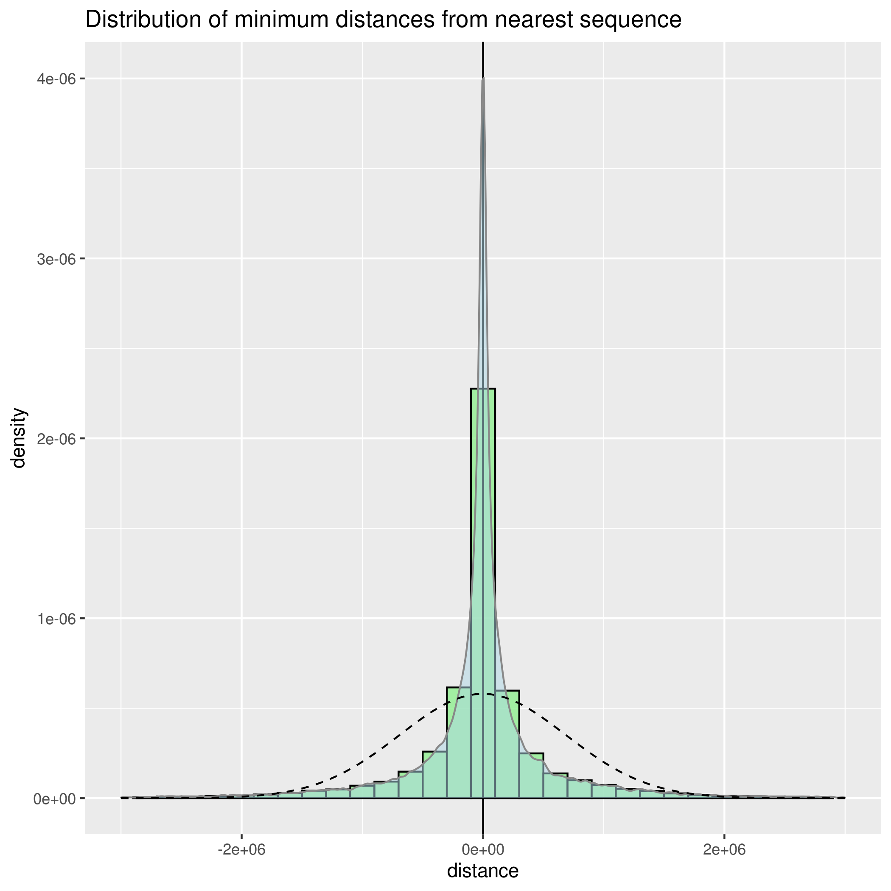

# Exercise solutions

This is a quick draft report with the required exercise results. Feel free to browse or ask for additional content as you see fit. This project shall be removed once you checked the results as it is currently public.

## First task

1. The coordinates of the overlapping regions are listed in [mES\_overlap.tsv](mES_overlap.tsv) and [ter119\_overlap.tsv](ter119_overlap.tsv). The script for generating the lists is presented in [exercise\_1.py](exercise_1.py). Please note that the coordinates have not been ordered, as this was not requested in the exercise. This can easily be amended if required. 
2. The unique regions can be found in [mES\_unique.tsv](mES_unique.tsv) and [ter119\_unique.tsv](ter119_unique.tsv), respectively. The same Python script linked above, and found in this repository was used to obtain the results.
3. The distances were recorded in the [mES\_distances.tsv](mES_distances.tsv) file. 
   - The requested histogram is presented below, and is also available as a full size image in the repository above in the file [hist\_dist.png](hist_dist.png). It was generated using the code in [R\_script.R](R_script.R).In the image, the green bars represent the binned counts of distances from each mES region to the nearest sequence in ter119, while the overlaid blue density plot shows the overall spread of the data. The dotted line represents a normal distribution fitted onto the data. The X axis displays the number of bases to the nearest region.
   
   

   

    
   
 
   

    
   - In terms of statistical distribution, the distribution of closest regions roughly follows
   a normal distribution with an almost perfectly centred mean (-2381.284) but a relatively large spread (sd = 687 488). A normal distribution with such parameters is fitted as the dotted line in the histogram above for reference. The unimodal distribution has a mild positive skew (0.097) and a kurtosis of 15.72 implying that more values are centred near the mean than in a normal distribution. The quantiles of the distances are as follows:	
   
   <table align="center">
    <thead>
        <tr>
            <td>0%</td>
            <td>25%</td>
            <td>50%</td>
            <td>75%</td>
            <td>75%</td>
        </tr>
    </thead>
    <tbody>
        <tr>
            <td>-5754066.5</td>
            <td>-129321.0</td>
            <td>-9.5</td>
            <td>122438.1</td>
            <td>5726707.5</td>
        </tr>
    </tbody>
</table>

   - Proposing a method for significance testing is challenging for this data set as no replicates are available. In this case, the most straightforward way is to set an arbitrary cutoff for separating significant hits from non-significant ones. While this is not a significance test in itself, it may be an easy and suitable method. A reasonable cutoff might be the 25% and 75% quantiles shown above, which will guarantee to include the most extreme half of the data set. Other reasonable cutoffs may be one or two standard deviations from the mean, depending on what the purpose of subsetting the data set is. 
   A more interesting solution may be to explore the two shoulders on both sides of the distribution at around 1.9m base pairs in either direction of the mean. However, before setting any cutoff or proposing a method to select significant hits, my honest recommendation would be to get more background on what these chromosomal locations represent, create a model of the underlying biology, and then clarify what is the question the experimenter wishes to answer. Doing this first will ensure that the proposed significance test is both appropriate for the data, and produces useful information.
   
## Second task

1. Converting the provided SAM file to BED format can be done with [sam2bed](https://bedops.readthedocs.io/en/latest/content/reference/file-management/conversion/sam2bed.html) using the command `sam2bed < chr11.sam > chr11_full.bed`. However, as this defeats the purpose of the exercise, a short script is provided in [sam2bed.py](sam2bed.py). The resulting [chr11.bed](chr11.bed) is also included.
2. The [wig\_maker.py](wig_maker.py) Python script was added to tackle the final exercise. As span compression was not implemented, the resulting WIG file is 1.3GB in size and consists of 118 843 811 lines, and is therefore not included here. However, it can be regenerated in minutes by executing the script.

On a personal note, I enjoy doing such exercises even just as a learning experience. I am happy to discuss any suggestions especially in case I got something wrong.
   