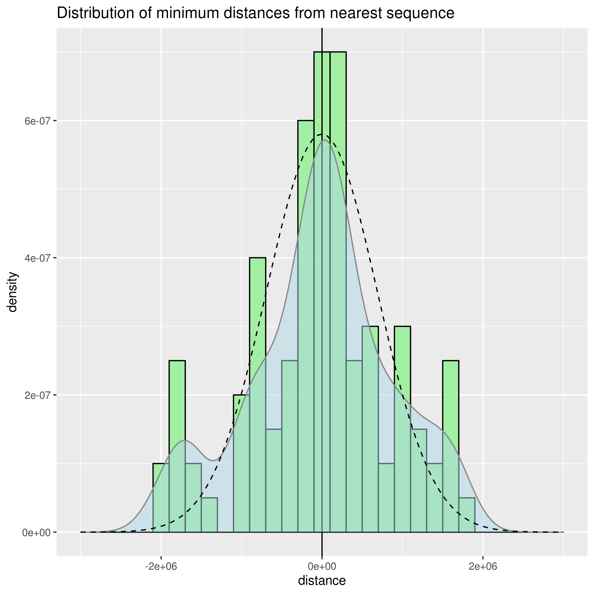

# Exercise solutions

This is a quick draft report with the required exercise results. Feel free to browse or ask for additional content as you see fit. This project shall be removed once you checked the results as it is public, and as such might accidentally give away the solutions to others.

## First task

1. The coordinates of the overlapping regions are listed in [mES\_overlap.tsv](mES_overlap.tsv) and [ter119\_overlap.tsv](ter119_overlap.tsv). The script for generating the lists is presented in [exercise\_1.py](exercise_1.py). Please note that the coordinates have not been ordered, as this was not requested in the exercise. This can easily be amended if requested. 
2. The unique regions can be found in [mES\_unique.tsv](mES_unique.tsv) and [ter119\_unique.tsv](ter119_unique.tsv), respectively. The same python file linked above, and found in this repository was used to obtain the results.

